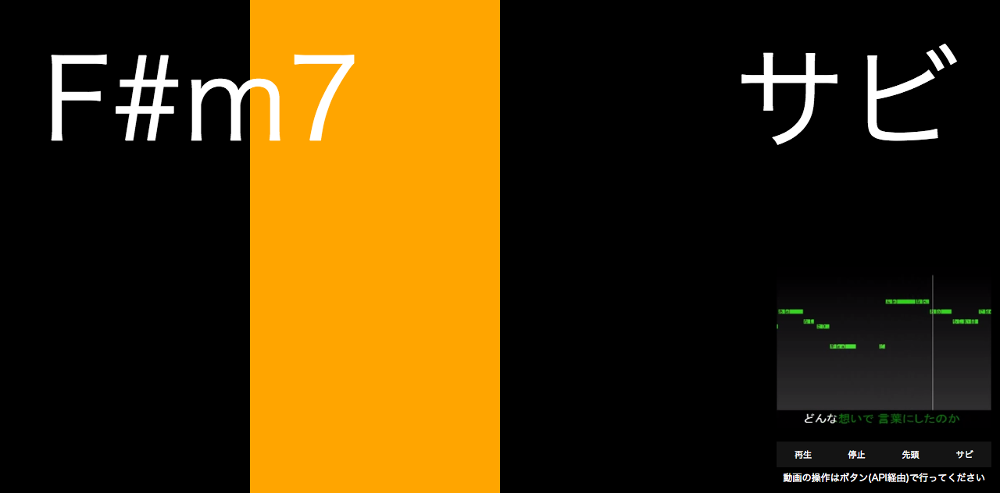

# Songle Sync ブラウザ向けプロジェクト
【※SampleソースのREADMEそのまま載せてます※】

ブラウザで動作するシンプルな Songle Sync アプリケーション例です  
引数で master/slave が切り替わります




## masterでアクセスする

`index.html` を引数 `master=1` を付けてブラウザで開いてください。  
右下に動画が表示され、再生・停止・先頭へシーク・サビ出しが出来ます。  

```
[ファイルパス]/index.html?master=1
```

## slaveでアクセスする

別ウィンドウで `index.html` をブラウザで開いてください。  
masterで再生される動画に合わせてバーやコード名が変化します。  
同じ`accessToken`であれば別のPCでもmasterに同期して動作します。

```
[ファイルパス]/index.html
```
